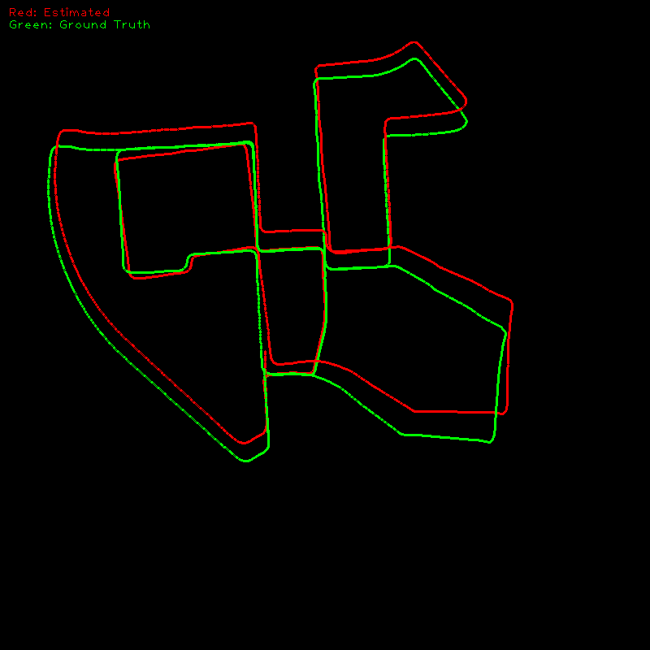

# Monocular Visual Odometry with KITTI Dataset

This project implements a Monocular Visual Odometry (VO) system using the KITTI Odometry dataset. The goal of visual odometry is to estimate the trajectory of a vehicle using only a single camera (monocular). This project uses OpenCV for feature detection, tracking, essential matrix computation, and pose estimation.

## Table of Contents
1. [Project Setup](#project-setup)
2. [About the KITTI Dataset](#about-the-kitti-dataset)
3. [Visual Odometry Overview](#visual-odometry-overview)
   - Monocular VO: Limitations and Advantages
   - Other Types of VO
4. [Steps for Monocular Visual Odometry](#steps-for-monocular-visual-odometry)
5. [Results and Discussion](#results-and-discussion)
6. [Usage](#usage)
7. [References](#references)

## Project Setup

### Requirements

To run the project, you need the following dependencies:

- OpenCV (4.x or higher)
- C++17 or higher
- CMake (for building the project)
- Python 3.x (for saving GIFs)
- g++ (or equivalent C++ compiler)

You can install the necessary dependencies using:

```bash
sudo apt-get install cmake libopencv-dev python3

```


## About Dataset 
The KITTI dataset is widely used in autonomous driving research. It contains data captured from a vehicle driving in urban environments, including camera images, LIDAR data, and GPS data. 

To use the KITTI dataset for odometry tasks, download the following datasets:
  1. Odometry Gray Image - [KITTI website](http://www.cvlibs.net/datasets/kitti/eval_odometry.php).
  2. Ground Truth Poses - [KITTI website](http://www.cvlibs.net/datasets/kitti/eval_odometry.php).

Once downloaded, unzip the datasets and place in the  `kitti-dataset` folder organize them in the following structure:
``` bash
kitti_dataset/
    ├── data_odometry_gray/
    │   ├── dataset/
    │   │   ├── sequences/
    │   │   │   ├── 00/
    │   │   │   │   ├── image_0/
    │   │   │   │   ├── calib.txt
    ├── data_odometry_poses/
    │   ├── dataset/
    │   │   ├── poses/
    │   │   │   ├── 00.txt
```
## Project Setup
1. Clone the repository
```bash 
git clone git@github.com:eliyaskidnae/Monocluar_VO.git
cd Monocluar_VO
```

2. Copy the `kitti-dataset` folder inside the project folder 

3. Build the project 
  ```bash 
   cd catkin_ws
   catkin build 

   ```

## Visual Odometry Overview
### What is Visual Odometry?
Visual Odometry (VO) is the process of estimating a camera's motion from a sequence of images. It calculates the trajectory of the camera relative to a world coordinate system by analyzing the movement of points in the images.
### Monocular VO: Limitations and Advantages

Monocular VO uses a single camera to estimate the camera's motion and the scene's 3D structure. Monocular VO has several advantages, such as low cost, simplicity, and ease of deployment. However, monocular VO has some limitations, such as scale ambiguity (the scale of the estimated trajectory is unknown) and drift (accumulated errors in the estimated trajectory).

### Other Types of VO
1. **Stereo VO:** Uses two cameras, resolving scale ambiguity by triangulating depth directly from the stereo camera pair.
2. **RGB-D VO:** Uses a depth camera (RGB-D) to get depth data, which helps with accurate motion estimation.
3. **LiDAR-based VO:** Uses LiDAR scans to compute the trajectory with higher accuracy.

## Steps for Monocular Visual Odometry
1. **Feature Detection:** Detect features (keypoints) in the first frame using detectors like FAST or ORB. The detected keypoints will be tracked in subsequent frames.
2. **Feature Matching and Tracking:** 
   - Once features are detected in the first frame, the next task is to track their movement across subsequent frames.
   - A common method for this is Optical Flow. One of the most popular algorithms for sparse optical flow tracking is Lucas-Kanade Optical Flow(cv::calcOpticalFlowPyrLK in OpenCV).Lucas-Kanade computes the displacement of the detected features from one frame to another by analyzing small windows around the feature points. It assumes that the intensity of the pixels of a feature remains constant between frames, and that the movement of these pixels can be approximated by a linear transformation.
3. **Handling Feature Loss:** Sometimes, features may be lost between frames due occlusion, motion blur, or lighting changes.To handle this, re-detection of features is triggered when the number of tracked features falls below a certain threshold. This ensures that the system continues to track a sufficient number of features for accurate pose estimation.

3. **Compute Essential Matrix :** Compute the essential matrix from corresponding feature points in two consecutive frames using cv::findEssentialMat. The essential matrix is key to estimating the camera's relative motion.
4. **Pose Estimation:** Decompose the essential matrix into rotation and translation vectors using cv::recoverPose. This estimates the relative pose between consecutive frames.
5. **Scale Calculation:** Monocular VO requires an external source (like GPS or ground truth data) to determine the absolute scale of motion. In this project, we use the ground truth poses from the KITTI dataset to compute the absolute scale.
6. **Pose Integration:** The final pose is calculated by accumulating the relative poses (rotations and translations) over the entire sequence.

## Results and Discussion

The results of the visual odometry are displayed in two windows:
1. Trajectory plot: This shows the estimated trajectory (in red) alongside the ground truth (in green)
2. Road-facing camera feed: This shows the current frame being processed.

<div style="display: flex; justify-content: space-between;">
  <div> 
    
     <p style="text-align: center;">Figure 1: Trajectory plot</p>

  </div>
</div>

<div style="display: flex; justify-content: space-between;">
  <div> 
    
     <p style="text-align: center;">Figure 1: Trajectory plot</p>
  </div>
  <div> 
    
     <p style="text-align: center;">Figure 1:  Road-facing camera feed</p>

  </div>
</div>